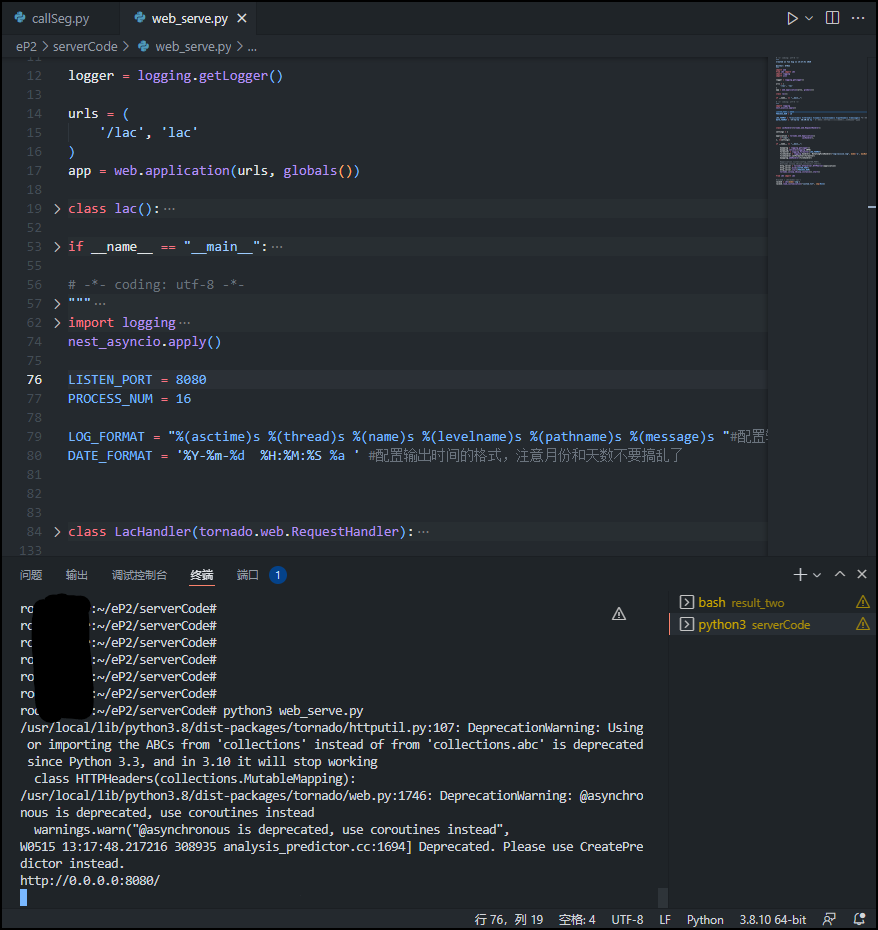
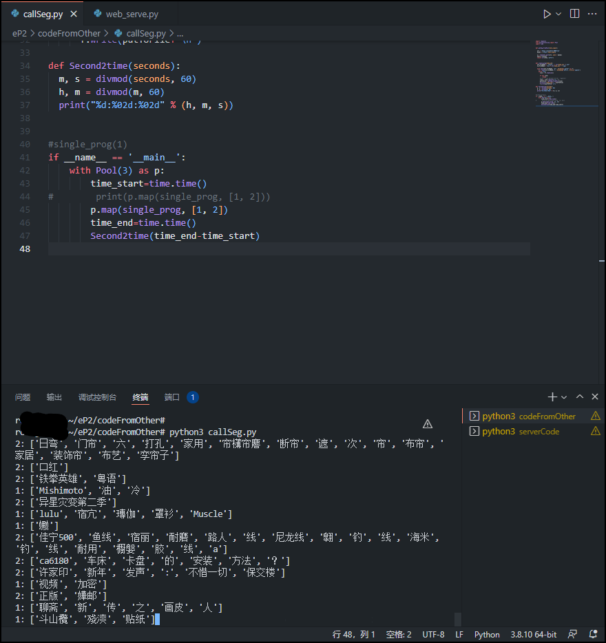
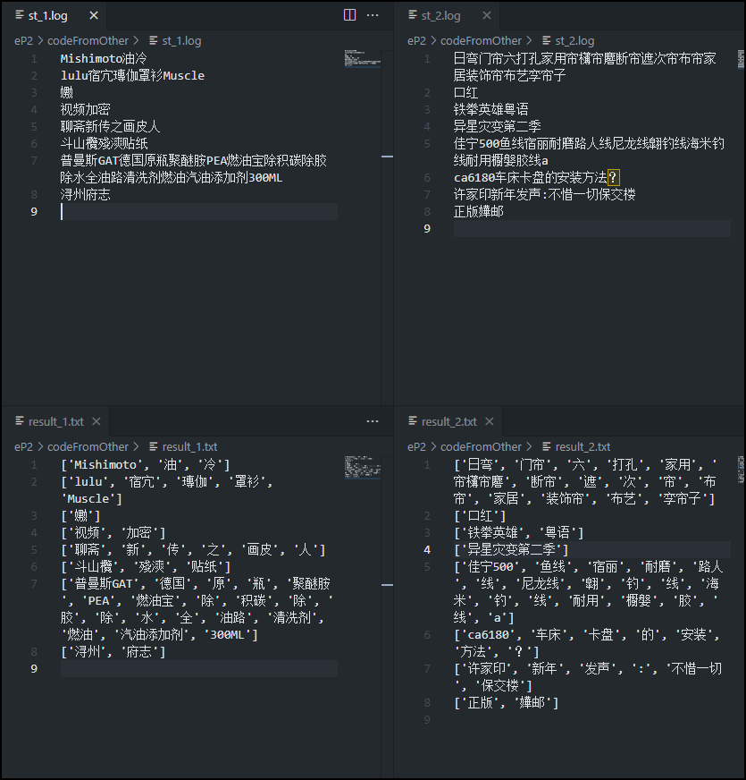

# 利用Python搭建在线分词服务

## 环境配置、代码编写
* 本机环境：Ubuntu 20.04 LTS x64
* 本机已安装：
```
Python 3.8.10
pip 20.0.2
```

### 前期准备
```
安装【lac】：
pip install lac

安装【web.py】：
pip install web.py

安装【tornado==5.1.1】：
pip install tornado==5.1.1
```

### 分词服务代码（服务端）

web_serve.py
```python
import web 
from LAC import LAC
import logging
import json

logger = logging.getLogger()

urls = (
    '/lac', 'lac'
)
app = web.application(urls, globals())
                  
class lac():
     #默认分词
     def POST(self):
        web.header("Access-Control-Allow-Origin", "*")
        web.header('content-type','text/json')    
        try:
          data = str(web.data(),"utf-8")
          dataDic = json.loads(data)
          #待分词文本
          text =  dataDic['text']
          lacmodel= ''
          meddledic=''
          #装载指定模型
          if 'model' in dataDic.keys():
              lacmodel =  dataDic['model']
              #可以通过model 参数加载自己训练的模型
              lac = LAC(model_path=lacmodel)
          else: 
              lac = LAC(mode='seg')
          #装载干预词典, sep参数表示词典文件采用的分隔符，为None时默认使用空格或制表符'\t'
          if 'meddledic' in dataDic.keys():
              meddledic=  dataDic['meddledic']
              #可以加载自定义的干预词典，进行自定义的语义分词，改文件需要放在与当前文件同级 目录下
              lac.load_customization(meddledic, sep=None)
          logger.info('lac input text:%s   lacmodel:%s   meddledic:%s' %(text,lacmodel,meddledic))
          seg_result = lac.run(text)
          logger.info(seg_result)
          return seg_result
        except Exception as e:
          logger.info("lac exception: %s: " %(str(e)))
          return [[],[]]
      
if __name__ == "__main__":
    app.run()

import logging
import tornado
import tornado.ioloop
import tornado.web
import tornado.httpserver
import tornado.gen
from tornado.concurrent import run_on_executor
# 这个并发库在python3自带在python2需要安装sudo pip install futures
from concurrent.futures import ThreadPoolExecutor
import json
#from lacmodel import lacmod
import nest_asyncio
nest_asyncio.apply()

LISTEN_PORT = 8080
PROCESS_NUM = 10

LOG_FORMAT = "%(asctime)s %(thread)s %(name)s %(levelname)s %(pathname)s %(message)s "#配置输出日志格式
DATE_FORMAT = '%Y-%m-%d  %H:%M:%S %a ' #配置输出时间的格式，注意月份和天数不要搞乱了

class LacHandler(tornado.web.RequestHandler):
    executor = ThreadPoolExecutor(100)
    @tornado.web.asynchronous
    @tornado.gen.coroutine
    def get(self):
        # 假如你执行的异步会返回值被继续调用可以这样(只是为了演示),否则直接yield就行
        res = yield self.handle()
        self.write(res)
        #self.finish()
        #self.handle()

    @tornado.gen.coroutine    
    def post(self):
        # 假如你执行的异步会返回值被继续调用可以这样(只是为了演示),否则直接yield就行
        res = yield self.handle()
        self.writejson(res)
        #self.finish()
        #self.handle()

    @run_on_executor 
    def handle(self):      
        result = {}
        try:
            bodyStr = str(self.request.body,"utf-8")   
            data = json.loads(bodyStr)
            text = data['text']
            seg_result = lacmod.run(text)
            #resp = seg_result
            result = {}
            result['code'] = "200"
            result['words'] = seg_result[0]
            result['tags'] = seg_result[1]
            result['msg'] = "分词成功"
            logging.info("LacHandler input: %s, result: %s"%(bodyStr,result))
        except Exception as e:
            logging.error("%s" % str(e)+" "+str(self.request.remote_ip))
            result['resultMsg'] = str(e)
            result['resultCode'] = "1111"
        finally:
            return result
    
    def prepare_head(self):
        self.set_header("Content-Type","application/json;chatset=utf-8")
        self.set_status(200)
        
    def writejson(self,obj):
        jsonstr = json.dumps(obj).encode("utf-8").decode("utf-8");
        self.prepare_head()
        self.write(jsonstr)

settings = {

}

application = tornado.web.Application([
    (r"/lac",             LacHandler),      
], **settings)

if __name__ == "__main__":   
 
    myapplog = logging.getLogger()
    myapplog.setLevel(logging.INFO)
    formatter = logging.Formatter(LOG_FORMAT)
    filehandler = logging.handlers. RotatingFileHandler("log/lacsize.log", mode='a', maxBytes=1024*1024*100, backupCount=10)#每 102400Bytes重写一个文件,保留5(backupCount) 个旧文件
    filehandler.setFormatter(formatter)
    myapplog.addHandler(filehandler)    
    
    #application.listen(config.LISTEN_PORT)
    #tornado.ioloop.IOLoop.instance().start()
    http_server = tornado.httpserver.HTTPServer(application)
    http_server.bind(LISTEN_PORT)
    http_server.start(PROCESS_NUM)
    tornado.ioloop.IOLoop.instance().start()

from LAC import LAC

lacmod = LAC(mode='seg')
lacmod.load_customization("custom.txt", sep=None)
```

#### 装载自己的词典文件
在(web_serve.py)文件的目录下，放置自己的字典文件，例如(custom.txt)，其内容格式如下：
```
春天/SEASON
花/n 开/v
秋天的风
落 阳
```

然后在服务端代码(web_serve.py)中，加载自己的字典：
```python
# 装载干预词典, sep参数表示词典文件采用的分隔符，为None时默认使用空格或制表符'\t'
lac.load_customization('custom.txt', sep=None)
```


#### 增加（服务端）并发线程数

```py
'''
你只需修改上述代码中【PROCESS_NUM = 10】这个数值。

'''

#比如我要开3个线程，那么修改的内容如下：
PROCESS_NUM = 3

```

#### （服务端）编译运行

```
python3 web_serve.py
```


### 本地读取log文件，调用分词接口的代码（客户端）

callSeg.py：
```python
import requests
from multiprocessing import Pool
import time


def getSeg_FromPost(text_input):

  url = 'http://localhost:8080/lac'
  myobj = {"text":text_input}

  x = requests.post(url, json = myobj)
  html=x.content  
  return str(html,'utf-8')


def single_prog(fake_id):
  out_fileName = 'result_' + str(fake_id) +".txt"
  in_fileName = "st_"+ str(fake_id) + ".log"
  
  with open(out_fileName, 'a+', encoding='utf-8') as f:
    fr = open(in_fileName,'r', encoding='UTF-8', errors='ignore')
    while True:
      line = fr.readline()
  
      if not line:
          break
      #line = line.decode("utf-8", "ignore")
      line = line.replace('\n','')
      putToFile = getSeg_FromPost(line)
      print(str(fake_id)+": "+putToFile)
      f.write(putToFile+'\n')

def Second2time(seconds):
  m, s = divmod(seconds, 60)
  h, m = divmod(m, 60)
  print("%d:%02d:%02d" % (h, m, s))


if __name__ == '__main__':
    with Pool(20) as p:
        time_start=time.time()
#        print(p.map(single_prog, [1, 2]))
        p.map(single_prog, [1, 2])
        time_end=time.time()
        Second2time(time_end-time_start)
```

#### 增加（客户端）并发进程数

```py
'''
你只需修改上述代码中【pool()】里面的参数，
以及增加【p.map()】第二个参数的个数，该参数是【single_prog(fake_id)】里面的参数【fake_id】
然后，你的log文件也要分【fake_id】份，
文件命名格式：【st_(num).log】，如【st_1.log】。

输出分词后的文件的命名是：【result_(num).txt】
'''

#比如我要调用3个进程，那么修改的内容如下：
with Pool(5) as p:
  ...
    p.map(single_prog, [1, 2, 3])

# 然后，提供3个log文件，命名为【st_1.log】、【st_2.log】、【st_3.log】；
# 最后会输出三个分词后的txt文件：【result_1.txt】、【result_2.txt】、【result_3.txt】
```

#### （客户端）编译运行

```
python3 callSeg.py
```



结果：


## 参考
以上内容，主要参考:
* [百度LAC开源分词接入](https://www.jianshu.com/p/68d82dd6962b)
* [lac/python](https://github.com/baidu/lac/tree/master/python)

